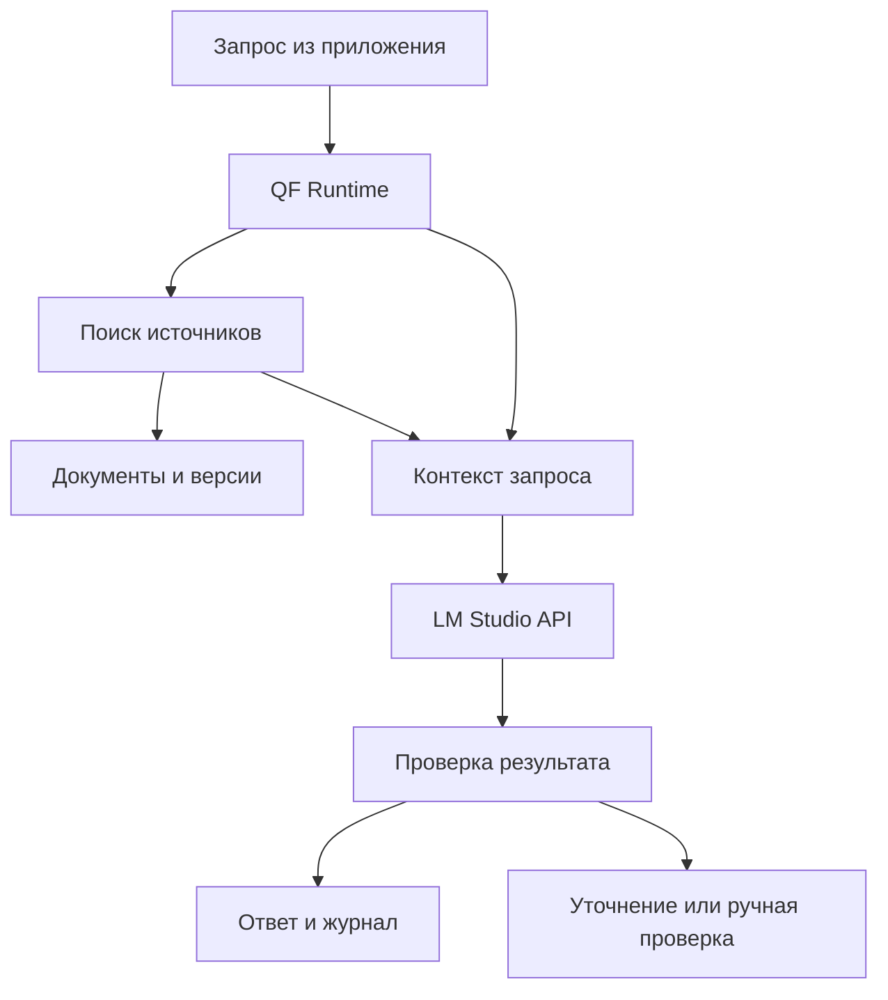

# Quattro Formaggi — план разработки

Версия: 0.1 • 22 сентября 2026 года • Для Михаила Фалалеева и реализации через Codex / Claude Code.

Статус: проектное предложение. Обучение не запускалось, веса не созданы. Конфигурации ниже — стартовые гипотезы; версии зависимостей и ресурсные лимиты необходимо зафиксировать после проверки оборудования.

## 1. Какой результат строим

**Quattro Formaggi — собственный проект языковой модели и инструментов её обучения, проверки и применения в логистике и торговом комплаенсе.**

Предлагаются два независимых направления:

| Направление | Что создаём | Для чего |
|---|---|---|
| QF-Lab, около 100M параметров | Собственная реализация Transformer, токенизатор, обучение со случайных весов | Понять нейросеть изнутри и действительно написать код самой модели |
| QF-12B, рабочая версия | Дообученная модель на открытых весах поддерживаемой архитектуры | Получить полезную локальную модель и запускать её через LM Studio |

QF-Lab не является обязательным предварительным условием QF-12B. Их можно проходить последовательно, начиная с учебной части, или сначала получить рабочую версию. Кодовые модули и контрольные точки этих направлений разделяются.

Для v0.1 предлагается один практический сценарий: **превращать запрос на перевозку в структурированную карточку груза и перечень недостающих данных**. Он проверяемый, соответствует твоему опыту и не требует сразу построить полноценную систему юридических выводов.

Первый релиз должен включать:

- адаптер LoRA с собственными обученными параметрами;
- точную ссылку на исходную модель и её revision;
- объединённую модель в Hugging Face-формате с tokenizer/config;
- GGUF для LM Studio;
- конфигурации, датасет или его закрытый манифест, отчёт о качестве;
- команды повторения обучения и экспорта;
- модельную карточку: происхождение, назначение, ограничения, лицензии.

Название производной версии: `Quattro-Formaggi-12B-Logistics-v0.1`. В карточке обязательно указывается исходная модель. Переименование файла само по себе не создаёт новых весов или новых способностей.

## 2. Что такое параметры, веса и обучение

Параметры — числа в матрицах и других обучаемых частях модели. «12B» означает примерно 12 миллиардов таких чисел. Это не 12 миллиардов фактов, не число нейронов и не количество строк программного кода.

Код определяет вычисления и размеры матриц. Веса определяют поведение конкретной обученной модели. Токенизатор преобразует текст в идентификаторы токенов: слов, частей слов, знаков и других фрагментов. Одинаковая архитектура с разными весами может отвечать совершенно по-разному.

При обучении с нуля:

1. Создаются матрицы и инициализируются случайными значениями.
2. Модель получает последовательность токенов.
3. Предсказывает следующий токен для каждой позиции.
4. Cross-entropy измеряет ошибку относительно реального продолжения.
5. Автоматическое дифференцирование вычисляет градиенты.
6. Оптимизатор обновляет веса.
7. Цикл повторяется на большом количестве текста; сохраняются контрольные точки.

До обучения большая модель способна только выдавать результат случайных вычислений. Качественное владение языком возникает благодаря данным и обучению.

При LoRA основная модель заморожена, обучаются небольшие дополнительные матрицы. Упрощённо: `W_new = W_base + scale × B × A`. После объединения адаптера с базой получаются изменённые полноценные веса. QLoRA экономит память, храня замороженную базу в 4-битном представлении во время обучения адаптера. Это отличается от обучения всех 12 миллиардов параметров. [S5]

Диалог в LM Studio сам по себе не обновляет веса. Сохранённая история чата и дообучение — разные механизмы.

## 3. Почему сразу обучать 12B с нуля — отдельный масштаб

Написать архитектуру и создать случайные веса реально. Сложность находится в подготовке корпуса, вычислениях, устойчивом обучении и проверке качества.

Иллюстрация масштаба, а не смета: для dense Transformer часто используют грубую оценку `C ≈ 6 × N × D`, где N — число параметров, D — число обработанных обучающих токенов. При N = 12 млрд и условных D = 240 млрд получается около `1.728 × 10^22 FLOP`.

Если предположить устойчивую полезную производительность 200 TFLOP/s на GPU, это примерно 24 000 GPU-часов, то есть 1 000 GPU-суток. Для восьми таких GPU идеальная оценка составляет 125 суток; реальное время зависит от межсоединений, загрузки, последовательностей и реализации. Это не прогноз для конкретной видеокарты и не включает все накладные расходы, неудачные запуски и подготовку данных.

240 млрд токенов выбраны для иллюстрации. Соотношения из исследований compute-optimal scaling — эмпирические ориентиры при определённых условиях, а не обязательный минимум и не гарантия качества. Для современной конкурентоспособной модели может потребоваться иной, существенно больший корпус. [S10]

Полное обучение требует памяти для весов, градиентов, состояний оптимизатора и активаций. Например, 16 байт постоянных состояний на параметр в одном распространённом варианте mixed-precision AdamW дают около 192 GB только на эти состояния для 12B; конкретная реализация может отличаться. Активации добавляются сверху. Квантованная модель, которую легко запустить, не становится столь же простой для полного обучения.

**Решение для первого проекта:** полноценный цикл «сам написал — сам обучил» пройти на QF-Lab; прикладную модель 12B получить дообучением существующей базы.

## 4. Исходная модель для рабочей версии

Исходный кандидат: `mistralai/Mistral-Nemo-Instruct-2407`. Он выбран как известная модель класса 12B с открытыми весами и понятным путём адаптации. Это не утверждение, что он лучший среди всех доступных моделей на дату запуска проекта. [S1]

| Свойство | Исходная конфигурация |
|---|---|
| Архитектура | Dense decoder-only Transformer, Mistral |
| Слои | 40 |
| Hidden size | 5 120 |
| Intermediate size | 14 336 |
| Attention heads / KV heads | 32 / 8 |
| Head dimension | 128 |
| Vocabulary | 131 072 |
| Позиционные представления | RoPE |
| Лицензия весов по карточке | Apache-2.0 |

Значения взяты из model card и config.json. Head dimension здесь задан явно: нельзя автоматически подменять его выражением `hidden_size / num_attention_heads`. [S1, S2]

Для SFT новичку проще начать с Instruct, уже умеющей следовать инструкциям. Base пригодится для отдельного эксперимента с продолжением предварительного обучения на большом отраслевом корпусе. В v0.1 такой эксперимент не входит.

До окончательного выбора сравнить кандидата хотя бы с одной доступной на момент реализации моделью 8–14B на одних и тех же собственных заданиях. Альтернативу выбрать после проверки лицензии, оборудования и конвертации. Если 8B решает задачу точнее или быстрее, размер 12B не должен становиться самоцелью.

Скачать исходные HF-веса для обучения; зафиксировать полный commit/revision. Не использовать случайный пользовательский merge или переупакованную модель с неясной историей в качестве первой базы. Сохранить исходный токенизатор и chat template. Не расширять словарь в первом релизе.

Совместимость считается подтверждённой только после реального пробного экспорта и загрузки в используемой версии LM Studio. Поддержка названия семейства ещё не проверяет правильность конкретного tokenizer/chat template.

## 5. Архитектура всего проекта

Четыре части Quattro Formaggi — это четыре программных компонента, а не обязательные четыре большие модели:

| Компонент | Назначение | Минимальная реализация |
|---|---|---|
| Model Lab | Собственная учебная архитектура, обучение с нуля | Python + PyTorch |
| Training | Подготовка данных и обучение QF-12B | Transformers + PEFT + TRL |
| Evaluation & Export | Сравнение версий, merge, GGUF | Python + llama.cpp |
| Business Runtime | Поиск документов, проверка полей, вызов локальной модели | Python CLI; FastAPI при появлении интеграции |

Обучение выполняется вне LM Studio. LM Studio используется для локального общения и выдачи ответов через API. Установленный runtime должен поддерживать архитектуру экспортируемой модели. GGUF — формат хранения, он сам по себе не добавляет поддержку произвольного слоя. [S3, S7]

### Личный режим

LM Studio загружает GGUF, пользователь общается с моделью. Для первых тестов отдельный сайт и собственный интерфейс не требуются.

### Прикладной режим



Для интеграции можно использовать OpenAI-compatible API LM Studio по базовому адресу `http://127.0.0.1:1234/v1`, если выбран порт 1234. Имя модели брать из `/v1/models`, а не угадывать по имени файла. Это локальный сервис LM Studio; использование совместимого клиента не означает отправку данных во внешний OpenAI API. [S4]

RAG не встраивается автоматически в GGUF. Чтобы приложение использовало собственную базу документов, поиск должен выполняться внешним Runtime и включать найденные фрагменты в запрос. Подключение такого поиска к самому интерфейсу LM Studio можно добавить отдельно через поддерживаемые интеграции; это не условие первого релиза.

## 6. Что дообучать, а что хранить отдельно

| Задача | Подход |
|---|---|
| Соблюдать JSON-схему карточки груза | SFT/LoRA + независимая валидация |
| Находить недостающие условия перевозки | Размеченные примеры + SFT |
| Писать письма в нужном стиле | Инструкции; SFT при устойчивых ошибках |
| Найти актуальную норму, исключение, дату действия | Документная база, поиск и метаданные |
| Проверить контрагента по спискам | Отдельный сервис поиска и сопоставления сущностей |
| Проверить применимость правил к операции | Данные сделки + правила + источники + экспертная проверка |
| Рассчитать массу, стоимость, сроки по формулам | Детерминированный код, единицы измерения и проверка |

Данные для обучения и база знаний имеют разные роли. Нельзя оценивать полноту санкционного скрининга только тем, нашла ли языковая модель похожий абзац. Нужны отдельные проверки имён, идентификаторов, структуры владения и применимых юрисдикций в рамках выбранной задачи.

Для комплаенса ответ должен содержать дату проверки, использованные источники, фактические основания, недостающие сведения и статус ручной проверки. При отсутствии достаточных данных система сообщает о неопределённости, а не генерирует уверенное разрешение операции. Это требование к качеству данного продукта, а не юридическая консультация по конкретной поставке.

На первом этапе подключать один узкий набор документов. Не переносить сразу весь существующий корпус проектов в новый pipeline.

## 7. Оборудование и память

Пока неизвестны твои CPU/GPU, RAM, VRAM и ОС. Следующие значения — ориентиры планирования, не обещания совместимости.

Теоретический объём только весов ровно 12B, в десятичных GB:

| Представление | Расчёт | Объём |
|---|---|---:|
| FP32 | 12 млрд × 4 байта | 48 GB |
| BF16 / FP16 | 12 млрд × 2 байта | 24 GB |
| INT8, идеальная упаковка | 12 млрд × 1 байт | 12 GB |
| 4-bit, идеальная упаковка | 12 млрд × 0.5 байта | 6 GB |

Реальный Q4_K_M больше идеальных 6 GB: не все тензоры используют ровно четыре бита, присутствуют масштабы и метаданные, а «12B» округлено. Для модели такого класса разумно ожидать файл порядка 7–8 GB, но финальный размер измеряется после экспорта.

При работе добавляются KV-cache, буферы, контекст, ОС и приложения. Для исходной конфигурации NeMo BF16 KV-cache на одну последовательность можно грубо оценить как `2 × 40 × 8 × 128 × context_tokens × 2 байта`: около 0.67 GB при 4 096 токенах и 1.34 GB при 8 192. Реальный runtime, тип cache и параллельные запросы меняют эти числа. Рекламируемое максимальное окно 128K не следует включать на первом запуске.

| Задача | Рабочий ориентир |
|---|---|
| QF-12B Q4, личный inference | 24–32 GB unified/system RAM как удобный ориентир; 16 GB возможны при ограниченном контексте и подходящем устройстве |
| Полное GPU-размещение для inference | Часто удобны 12–16 GB VRAM при небольшом контексте; подтвердить замером |
| QLoRA 12B, Linux + NVIDIA | Начать оценку с 24 GB VRAM, batch 1, 1–2K контекст; 48 GB дают больше запаса, но вместимость всё равно проверяется |
| HF merge/export | Желательно 48–64 GB RAM и 100–150 GB свободного SSD; 32 GB могут оказаться тесными |
| QF-Lab около 100M | Учебные CPU-прогоны возможны; практическое обучение лучше на GPU, размер batch подбирается |

Сочетание длинного контекста, больших logits, LoRA rank, активаций и конкретного training backend может привести к OOM даже при формально достаточном объёме VRAM.

Для macOS текущая документация LM Studio указывает Apple Silicon и macOS 14+, а Intel Mac не поддерживается. Версию ОС и процессор нужно проверить непосредственно на компьютере. [S3]

Для первого воспроизводимого QLoRA-пути предлагается Linux + NVIDIA CUDA. Если у тебя Apple Silicon без NVIDIA, использовать Mac для данных, разработки и inference, а обучение — на отдельной подходящей машине; либо отдельно спроектировать и проверить MLX LoRA-путь. Нельзя считать CUDA/bitsandbytes-конфигурацию готовым рецептом для Mac.

Перед арендой оборудования выполнить короткий benchmark с реальными длинами данных. Аренду и скачивание больших весов этот документ не запускает.

## 8. Организация репозитория

Один Python-репозиторий с двумя независимыми направлениями и общими средствами оценки. Названия ниже — проектируемые файлы, сейчас они ещё не реализованы.

| Путь | Содержимое |
|---|---|
| `README.md` | Цель, quick start, поддерживаемое оборудование |
| `AGENTS.md` | Правила реализации и проверки для coding agents |
| `pyproject.toml`, lockfile | Пакет, зависимости, воспроизводимые версии |
| `docs/PROJECT.md` | Границы продукта и критерии релиза |
| `docs/ARCHITECTURE.md` | Компоненты, потоки и форматы |
| `docs/DECISIONS.md` | Причины выбора базы, backend, настроек |
| `docs/DATA_SPEC.md` | Схема, происхождение, разметка, разбиение |
| `docs/EVAL_SPEC.md` | Замороженные задания и метрики |
| `configs/lab/` | Конфигурация небольшой модели с нуля |
| `configs/train/`, `configs/inference/` | QLoRA и локальное выполнение |
| `src/qf/lab/` | Transformer, tokenization, training loop |
| `src/qf/data/` | Подготовка, дедупликация, проверки |
| `src/qf/training/` | Загрузка базы и обучение адаптера |
| `src/qf/eval/` | Baseline, метрики, сравнение экспериментов |
| `src/qf/export/` | Merge, HF-пакет, GGUF, проверка |
| `src/qf/runtime/` | Клиент LM Studio, схемы, RAG, валидация |
| `tests/` | Проверки масок, данных, вычислений, экспорта |
| `data/{raw,processed,splits}/` | Закрытые локальные данные, вне Git |
| `artifacts/{adapters,merged,gguf}/` | Веса, вне обычного Git |
| `runs/<run_id>/` | Метрики, config, логи, контрольные точки |
| `third_party/llama.cpp/` | Зафиксированный commit инструмента экспорта |

Python 3.11 — начальный кандидат; окончательно выбрать версию, поддерживаемую всеми необходимыми пакетами на целевой машине. Разделить зависимости на `core`, `train-cuda`, `lab`, `runtime`, `dev`, чтобы локальному клиенту не требовалась установка CUDA-обучения.

Для v0.1 достаточно PyTorch, Transformers, Datasets, PEFT, TRL, Accelerate, bitsandbytes для CUDA-пути, Pydantic, pytest и средства фиксации зависимостей. Не добавлять несколько фреймворков обучения одновременно. FastAPI, векторное хранилище и серверную БД вводить тогда, когда реализуется соответствующий этап.

Зафиксировать Python, пакеты, драйвер/GPU, CUDA, model revision, tokenizer hash, chat-template hash, dataset hash и commit llama.cpp. До фиксации версий не обещать работоспособность конкретных параметров библиотечного API.

Для каждого запуска сохранять `run_manifest.json`: run_id, git_commit, hardware, package_versions, base_revision, data_hashes, seed, config, parent_checkpoint, metrics, wall_time, peak_memory. Веса хранить отдельно от Git; резервная копия обязательна для результатов, которые трудно воспроизвести.

## 9. Данные для первого fine-tuning

### Первый набор задач

1. Извлечение массы, размеров, количества мест, маршрута и сроков из запроса.
2. Выявление отсутствующих исходных данных для оценки перевозки.
3. Нормализация единиц без изменения смысла исходного текста.
4. Разделение данных документа и собственных предположений.
5. Ответы по приложенному фрагменту документа со ссылкой на его ID.

Для smoke test достаточно 20–50 проверенных примеров. Первый содержательный пилот: ориентировочно 500–1 500 примеров. Расширение до 3–10 тысяч имеет смысл после анализа ошибок. Эти количества — план набора данных, а не гарантия качества.

Измерять и число примеров, и число токенов, и распределение длин. Тысяча коротких примеров и тысяча длинных документов — разные бюджеты обучения.

Начальный состав можно сделать таким: 60% извлечения и карточек груза, 20% уточняющих вопросов, 10% ответов по источнику, 10% общих инструкций и деловой переписки. Это экспериментальный состав; русский/английский баланс установить по реальным сценариям. Итальянский оставить в regression-наборе, если он нужен.

### Формат одной записи

```json
{
  "id": "logistics_0001",
  "task": "shipment_extraction",
  "group_id": "case_001",
  "source_id": "synthetic_reviewed_001",
  "language": "ru",
  "reviewed": true,
  "messages": [
    {"role": "system", "content": "Извлеки данные груза. Неизвестные поля заполни null. Верни JSON."},
    {"role": "user", "content": "Нужно перевезти один аппарат массой 42 т. Размеры 8,5 × 3,2 × 3,6 м. Из Казани в Уфу. Дата пока не определена."},
    {"role": "assistant", "content": "{\"cargo_name\":\"аппарат\",\"pieces\":1,\"mass_kg\":42000,\"length_m\":8.5,\"width_m\":3.2,\"height_m\":3.6,\"origin\":\"Казань\",\"destination\":\"Уфа\",\"shipping_date\":null}"}
  ]
}
```

В JSONL каждая запись занимает одну физическую строку. Пример выше развёрнут только для чтения. Поля массы следует точнее определить в DATA_SPEC: масса одного места или общая; при неясности модель должна запросить уточнение.

### Проверки данных

- [ ] На каждый реальный документ есть сведения об источнике и допустимом использовании.
- [ ] Исключены секреты, персональные данные и клиентские реквизиты, не нужные для задачи.
- [ ] Синтетические примеры помечены; специалист проверил поля, числа и выводы.
- [ ] Нет точных и близких дубликатов между train, validation и test.
- [ ] Все варианты одного документа, клиента или кейса объединены через group_id до разбиения.
- [ ] Начальное разбиение 80/10/10 выполнено по группам, а не по отдельным сообщениям.
- [ ] Замороженный отдельный benchmark не попадает в обучение и генерацию синтетики.
- [ ] Исторические и актуальные нормативные документы имеют даты и версии.
- [ ] Проверены tokenizer, EOS, padding, отсутствие двойных special tokens.
- [ ] Текст внутри документов рассматривается как данные, а не команды системе.

Не считать автоматически хорошие ответы другой LLM эталонными. Сначала проверить вручную. Часть кейсов должна содержать отсутствующие, противоречивые и недостаточные данные, чтобы обучить корректное уточнение.

## 10. Начальные настройки QLoRA

Ниже проектная YAML-схема, которую нужно реализовать в собственном коде. Это не файл, который TRL обязан принять напрямую.

```yaml
run_name: qf-12b-logistics-v0.1
seed: 42
model:
  id: mistralai/Mistral-Nemo-Instruct-2407
  revision: REQUIRED_PINNED_COMMIT
  preserve_tokenizer: true
  preserve_chat_template: true
quantization:
  load_in_4bit: true
  type: nf4
  double_quant: true
  compute_dtype: bfloat16_if_supported
lora:
  rank: 16
  alpha: 32
  dropout: 0.05
  target_modules: [q_proj, k_proj, v_proj, o_proj, gate_proj, up_proj, down_proj]
training:
  max_sequence_length: 2048
  micro_batch_size: 1
  gradient_accumulation_steps: 16
  learning_rate: 0.0001
  epochs: 1
  warmup_ratio: 0.03
  lr_scheduler: cosine
  max_grad_norm: 1.0
  gradient_checkpointing: true
  use_cache: false
  packing: false
  loss_scope: assistant_tokens_only
  checkpoint_every_optimizer_steps: 50
  evaluate_every_optimizer_steps: 50
  keep_checkpoints: 3
logging:
  external_reporting: false
  record_peak_memory: true
```

Перед запуском проверить, что указанные target modules существуют в загруженной модели. Список охватывает attention и MLP, исключая embeddings и выходную голову. Напечатать фактическое число trainable parameters. [S5]

На одном GPU effective batch при этих настройках составляет 16 последовательностей на optimizer step. При нескольких GPU масштабирование изменяет его; первый релиз использует один GPU.

Вызвать подготовку модели для k-bit training; проверить dtype, устройства и поддержку BF16. Если BF16 недоступен, выбрать и проверить подходящий FP16-путь; не просто менять строку без теста стабильности. Для одного GPU явно разместить модель на нём, а не полагаться на inference-распределение `device_map=auto`.

`loss_scope` необходимо преобразовать в реально поддерживаемую библиотекой маску. В TRL assistant-only loss зависит от шаблона и корректной assistant mask. Проверить это на токенах нескольких реальных примеров. Если шаблон не предоставляет маску, реализовать корректный collator/маскирование или совместимый prompt-completion pipeline. Нельзя незаметно перейти на обучение по всем сообщениям. [S6]

Контролировать долю обрезанных примеров. Удаление ответа при truncation может оставить запись без обучаемых токенов. Такие случаи должны останавливать подготовку с объяснением либо обрабатываться явно.

Первый технический прогон: 10–20 optimizer steps на небольшом наборе. Затем 1 эпоха на пилоте. Для коротких запусков validation и checkpoint обязательны и в конце, даже если интервал 50 steps не достигнут. Вторую эпоху и больший rank рассматривать по результатам validation. Снижение train loss без улучшения независимых заданий не считается успехом.

## 11. Собственная модель QF-Lab с нуля

Учебная архитектура: dense decoder-only Transformer в стиле Llama. Цель — собственная реализация вычислений, а не изобретение нового attention.

| Настройка | Стартовое значение |
|---|---:|
| Слои | 12 |
| Hidden size | 768 |
| Intermediate size | 2 048 |
| Attention heads | 12 |
| KV heads | 4 |
| Head dimension | 64 |
| Vocabulary | 32 768 |
| Context | 512 для отладки; 1 024 для следующего этапа |
| Нормализация | RMSNorm |
| FFN | SwiGLU, без bias |
| Позиции | RoPE |
| Embedding / LM head | Общие веса, tied embeddings |

При указанных допущениях размер примерно 100.7M параметров; точное количество скрипт считает по уникальным параметрам, не удваивая tied weights. Для CPU-smoke дополнительно иметь конфигурацию 2 слоя / hidden 128 / короткий контекст, чтобы тесты не зависели от большого обучения.

Написать модули `config.py`, `rmsnorm.py`, `rope.py`, `attention.py`, `mlp.py`, `model.py`, `train.py`, `generate.py`. Автоматическое дифференцирование и базовые тензорные операции предоставляет PyTorch; писать собственный CUDA backend для первой модели не нужно.

Порядок работы:

1. Подготовить небольшой разрешённый корпус русских и английских текстов.
2. Обучить BPE-токенизатор только на train-корпусе; проверить русский, числа, размеры, коды.
3. Реализовать forward, causal mask, next-token loss и generation.
4. Проверить отсутствие доступа к будущим токенам.
5. Добиться запоминания одного маленького batch как диагностического теста.
6. Проверить save/load и продолжение обучения с состоянием оптимизатора, scheduler, RNG и позиции данных.
7. Провести ограниченный запуск, например на 10–50 млн обработанных токенов.
8. Оценить validation loss и образцы продолжения текста.

10–50 млн токенов — учебный бюджет проверки pipeline; он не обещает полноценного ассистента на 100M. Если цель — сильная небольшая модель, объём качественных данных и обучение необходимо существенно пересмотреть.

Начальные гипотезы: AdamW, learning rate 3e-4, cosine decay, warmup около 2%, gradient clipping 1.0; batch выбирается по памяти. Прежде всего проверяются loss, gradients и качество данных, а не перебираются десятки гиперпараметров.

Экспорт в LM Studio — дополнительная задача: собственная реализация должна математически соответствовать поддерживаемой архитектуре, включая порядок RoPE, GQA, norm и tying. Нужен явный mapping в HF-формат и сравнение logits с эталонной реализацией при одинаковых весах и входах. Простое переименование `model_type` в `llama` не делает произвольную модель совместимой. Если соответствие не доказано, QF-Lab остаётся в собственном inference-скрипте.

## 12. Экспорт рабочей модели в LM Studio

1. Сохранить адаптер, исходный revision, tokenizer и training manifest.
2. Загрузить ту же исходную модель в BF16/FP16 без 4-bit quantization, выбрав формат по исходным весам и поддержке инструментов.
3. Подключить адаптер и выполнить merge в полноценные веса.
4. Сохранить полный HF-пакет и проверить его загрузку отдельно.
5. Сравнить модель с адаптером и объединённую версию на фиксированных заданиях; учесть, что QLoRA обучалась с квантованной базой.
6. Конвертировать HF-пакет в GGUF высокого разрешения поддерживаемым `convert_hf_to_gguf.py`.
7. Сделать Q4_K_M; при ресурсах добавить Q5_K_M для сравнения качества и размера.
8. Проверить tokenizer, chat template, EOS и ответы GGUF.
9. Импортировать файл в LM Studio и повторить benchmark через его runtime.

Merge/export может требовать больше обычной RAM, чем QLoRA требует VRAM. Сохранять исходную базу и адаптер отдельно даже после успешного объединения. Не использовать GGUF Q4 как единственный мастер для будущих дообучений. Для следующей версии предпочесть ту же базу с обновлённым адаптером либо явно зафиксированного нового родителя. [S5, S7, S8]

Пример будущей команды после создания файла:

```bash
lms import ./artifacts/gguf/Quattro-Formaggi-12B-Logistics-v0.1-Q4_K_M.gguf
```

`lms import` — документированный способ импорта локального файла. Перед выполнением проверить наличие CLI и свободное место; поведение копирования/перемещения и доступные флаги сверить с установленной версией. [S9]

Начальные настройки LM Studio: context 4 096, output до 768–1 024 токенов, temperature 0–0.2 для извлечения, один запрос одновременно. Это экспериментальные настройки, не оптимум для всех задач. Для benchmark temperature 0 и одинаковый prompt; полная побитовая воспроизводимость между разными backends всё равно не гарантируется.

При структурированном выводе использовать JSON Schema, если выбранный endpoint/runtime поддерживает ограничение формата, и всегда проверять результат независимым валидатором. Валидный JSON не доказывает правильность значений.

## 13. Оценка качества и критерии релиза

Сначала измерить исходную модель. Только затем обучать адаптер. Benchmark должен быть зафиксирован до просмотра результатов дообучения.

Первый независимый набор: около 200 кейсов из разных документов и ситуаций, например 80 извлечений, 40 недостающих данных, 40 ответов по источнику и 40 общих/регрессионных заданий. Для включения комплаенса нужен отдельный набор с экспертной разметкой; логистические метрики не подтверждают качество юридических выводов.

Сравнить четыре условия:

| Условие | Что выясняем |
|---|---|
| Исходная модель + одинаковый prompt | Нужен ли fine-tuning вообще |
| Исходная модель + RAG | Достаточно ли добавить источники |
| QF adapter без RAG | Что изменилось именно от обучения |
| QF adapter + RAG | Как работает итоговая система |

Если RAG ещё не реализован, сначала сравнить исходную и дообученную версии, а оставшиеся два условия добавить на соответствующем этапе. Для честности сохранять одинаковые задания, доступные документы и бюджеты контекста.

Предварительные release gates, которые следует утвердить после baseline:

| Метрика | Целевой порог пилота |
|---|---|
| JSON соответствует схеме с первого ответа | ≥98% заданий, где требуется JSON |
| Точность ключевых полей | ≥95% по заранее описанной нормализации |
| Улучшение основной метрики | ≥5 процентных пунктов к baseline либо сопоставимое качество при измеримом выигрыше скорости/стоимости |
| Общая регрессия | Не более 3 процентных пунктов на отдельном общем наборе |
| Вымышленные критические основания/ссылки | 0 на замороженном наборе критических кейсов |
| Квантование | Не более 2 процентных пунктов потери основной метрики к merged-версии; без новых критических ошибок |
| Работоспособность | Нет OOM/сбоев на согласованной матрице длин и запросов |

Пороги — цели проекта, не доказательство надёжности в реальном мире. При 200 кейсах неопределённость существенна: сохранять сырые результаты, считать доверительные интервалы/парное сравнение и вручную разбирать изменившиеся ответы. Если baseline уже близок к максимуму, требование +5 п.п. заменить заранее выбранным достижимым критерием, не подгоняя его после теста.

Для RAG дополнительно измерять recall@k нужных источников, корректность цитат, применимость версии документа и случаи недостаточного контекста. При оценке комплаенса приоритет — опасные пропуски и необоснованные разрешения, а не только средний балл.

Для производительности фиксировать время до первого токена, tokens/sec, полную задержку p50/p95, RAM/VRAM и длины запроса/ответа. Целевую скорость установить после замера твоего оборудования.

## 14. План работ по этапам

Трудозатраты ниже — предварительные часы активной работы одного человека с помощью coding agent, без ожидания загрузок/GPU и без масштабной ручной разметки. Для первого ML-проекта возможен существенный перерасход. Это не обещание календарного срока.

| Этап | Действия | Результат и критерий завершения | Оценка |
|---|---|---|---:|
| 0. Паспорт проекта | Выбрать один сценарий, оборудование, бюджет, языки | PROJECT.md, hardware.json, ограничения зафиксированы | 2–4 ч |
| 1. Репозиторий | Пакет, CLI, config, logging, doctor, зависимости | doctor определяет окружение; CPU-smoke воспроизводится | 4–8 ч |
| 2. Baseline и совместимость | Запустить базу, собрать benchmark, проверить экспортный маршрут | Отчёт исходной модели и реальная загрузка тестового GGUF | 6–12 ч |
| 3. Данные | Схема, очистка, группировка, train/val/test, проверка масок | Валидированный пилотный датасет без пересечений | 8–16 ч + разметка |
| 4. QLoRA pipeline | Smoke run, resume, метрики, memory benchmark | 10–20 steps без NaN/OOM, только ожидаемые параметры обучаются | 6–12 ч |
| 5. Эксперимент | Один пилотный run, анализ ошибок, максимум одна обоснованная итерация | Сравнение с baseline; решение принять/отклонить адаптер | 4–8 ч + GPU |
| 6. Merge и GGUF | Объединение, конвертация, квантование, LM Studio | Файл загружается; выполнены quality gates | 4–8 ч |
| 7. Узкий RAG | Документы, метаданные, поиск, цитаты, локальный API | Ответы подтверждаются источниками; ошибки поиска измерены | 12–24 ч |
| 8. Выпуск | Карточка, manifest, команды, резервные копии | Повторяемая сборка и зафиксированные ограничения | 3–6 ч |
| L. Учебный QF-Lab | Собственный Transformer, обучение, save/load, генерация | Собственные веса и воспроизводимый учебный эксперимент | 20–40 ч + GPU |

Этапы 0–6 и 8 дают первую локальную QF-12B без полноценного RAG: ориентировочно 37–74 активных часа плюс разметка и вычисления. С RAG: 49–98 часов. QF-Lab добавляется отдельно. Для новичка разумнее планировать работу этапами с проверками, а не обещать модель за выходные.

Разметка может стать основной статьёй времени: 1 000 примеров даже по 3 минуты проверки — около 50 часов. Создание сложных примеров и экспертная верификация потребуют больше.

### Оценка вычислительного бюджета

Не закладывать тариф аренды без проверки провайдера на момент запуска. Сначала измерить throughput. Формула:

`GPU_hours ≈ processed_training_tokens / measured_tokens_per_second / 3600`

Затем прибавить validation, checkpoints, загрузку и резерв. Убедиться, что в числителе и знаменателе одинаковое понимание токенов: все обработанные токены, а не только те, по которым считается loss.

Условный пример, не рыночная цена и не прогноз скорости: 2 000 записей со средней длиной 1 000 токенов, 1 эпоха, измеренные 200 tokens/sec → примерно 2.8 часа вычисления основного цикла. Реальная оплачиваемая сессия будет длиннее.

`Стоимость = оплачиваемые GPU-часы × действующий тариф + хранение + передача данных`, если провайдер её тарифицирует. До длинного запуска установить лимит длительности, max_steps, checkpoint и правила остановки.

## 15. Минимальный RAG для второй версии

Сначала 20–100 документов одного процесса. Нужны текст, source_id, название, версия, дата действия, дата получения, URL/путь и при необходимости юрисдикция. Таблицы и страницы должны сохранять связь с источником.

Стартовая гипотеза chunking: 500–800 токенов с небольшим перекрытием. Разделять по смысловым границам; не разрывать нормы с исключениями и строки таблиц без контекста. Найденные куски не должны подменять полный документ при проверке применимости.

Для прототипа достаточно файлов + SQLite/FTS для точного поиска и локального векторного индекса при необходимости. Использовать отдельную embedding-модель, проверенную на русских/английских документах. Выбрать её по retrieval benchmark, лицензии и оборудованию на этапе реализации. Генерирующую QF-12B не нужно автоматически превращать в embedding-модель.

Начать с top-k 5–8, затем измерить recall и достаточность контекста. Точные номера норм, коды и идентификаторы требуют lexical/structured search; смысловой поиск дополняет его. Reranker добавлять после обнаруженной проблемы ранжирования.

Новый документ должен попадать в индекс без переобучения LLM. Удаление или замена документа должны исключать старую версию из актуального поиска, сохраняя её в аудиторской истории. Runtime проверяет, что возвращённые source_id действительно существуют среди полученных источников; содержательную обоснованность проверяет отдельная оценка.

Для интеграции со своими приложениями добавить FastAPI и контракт ответа: result, sources, missing_fields, model_version, knowledge_version, checked_at, review_required. Не выдавать числовой confidence за калиброванную вероятность, если калибровка не проводилась.

## 16. Задания для Codex / Claude Code

Код писать короткими завершёнными изменениями. После каждого задания агент должен показать изменённые файлы, выполненные проверки и критерий готовности. Один агент редактирует конкретную область репозитория в каждый момент; при использовании двух инструментов разделить ветки/worktrees и ответственности.

### Задание 1 — каркас

Создать пакет `qf`, конфигурации, команду `qf doctor`, документацию и CPU-smoke. Doctor только читает параметры окружения и сохраняет отчёт. GPU, train-библиотеки и секреты для его запуска не обязательны. Не скачивать большие модели на этой стадии.

### Задание 2 — данные и контракт

Реализовать Pydantic-схемы, JSONL validation, отчёт длины, дедупликацию, split по group_id. На синтетических fixtures проверить отсутствие пересечения групп и корректность null/чисел/единиц. Обнаруженные проблемы должны иметь ID записи и причину.

### Задание 3 — baseline

Реализовать клиент существующего локального endpoint, получение model ID, сохранение входов/ответов/метрик. Проверить таймауты и невалидный JSON. Никакого скрытого fallback на внешний платный сервис.

### Задание 4 — train

После проверки оборудования подключить выбранный CUDA stack. Загрузить pinned model revision, настроить LoRA, вывести trainable parameters, проверить маски и выполнить короткий прогон. Реализовать checkpoint/resume и контроль max_steps. Оценить память и время полного пилота.

### Задание 5 — export

Реализовать merge на точной исходной базе, сохранение tokenizer/config, конвертацию pinned llama.cpp и Q4_K_M. Сохранить SHA-256 артефактов. Сравнить adapter, merged и GGUF версии на одном наборе.

### Задание 6 — локальная приёмка

Импортировать созданный файл, получить ответ через LM Studio API, выполнить benchmark. Не отмечать задачу выполненной только потому, что файл успешно создан.

### Задание 7 — QF-Lab

Отдельным изменением реализовать небольшой Transformer. Проверить causal mask, gradients, один batch, checkpoint round-trip и generation. Обучение 12B с нуля не запускать по наследованию настроек от учебной модели.

### Задание 8 — RAG

Реализовать загрузку небольшого корпуса, версии документов, retrieval и ответы с source_id. Проверить отсутствие источника, конфликт версий и инструкцию внутри документа. Добавить API только после работоспособного CLI-прохода.

### Стартовый мастер-промпт

```text
Ты — инженер проекта Quattro Formaggi. Используй
Quattro_Formaggi_DEVELOPMENT_PLAN.md как исходный проектный план.

Цель: создать воспроизводимый проект обучения и оценки собственной
производной языковой модели около 12B для логистики с экспортом в
LM Studio. Отдельное учебное направление — небольшой Transformer
с собственной реализацией и обучением со случайных весов.

Начни с этапов 0–1: обследуй доступное окружение read-only, зафиксируй
неизвестные параметры, создай документацию и минимальный Python-пакет.
Не переходи автоматически к скачиванию весов и длительному обучению.

Правила реализации:
1. Разделяй собственную учебную архитектуру и дообучение исходной модели.
2. Не утверждай, что переименование модели создаёт новые веса.
3. Не изменяй архитектуру/tokenizer рабочей базы в первом релизе.
4. Фиксируй revision модели, версии библиотек, dataset hash и seed.
5. Сделай CLI doctor, validate-data и eval-baseline; train/export
   добавляй на соответствующих этапах, без имитации выполнения.
6. Если код ещё не реализован, команда должна явно завершаться
   с ошибкой, а не возвращать фиктивный успешный результат.
7. Не отправляй документы и веса во внешние сервисы автоматически.
8. Перед GPU-run оцени память, длительность и лимит затрат.
9. Проверяй отсутствие data leakage и корректность loss mask.
10. Сохраняй полноценные checkpoint/resume и отчёты экспериментов.
11. Считай экспорт завершённым после загрузки и проверки в runtime.
12. В каждый момент реализуй один этап и соблюдай его acceptance criteria.

Сейчас создай README.md, AGENTS.md, docs/PROJECT.md,
docs/ARCHITECTURE.md, docs/DATA_SPEC.md, docs/EVAL_SPEC.md,
pyproject.toml, структуру src/qf, конфигурационные схемы,
qf doctor и минимальные содержательные проверки.

Если оборудование пока неизвестно, не придумывай его характеристики:
сделай конфигурацию, которую можно заполнить позднее. В результате
покажи структуру, команды запуска, фактически выполненные проверки,
нерешённые вопросы и следующий этап. Не создавай фиктивные веса.
```

## 17. Ошибки, которые нужно ловить заранее

| Ошибка | Как обнаружить / исправить |
|---|---|
| Модель «знает» ответы, потому что test попал в train | Разбиение по исходным кейсам и проверка дубликатов |
| Train loss падает, практическое качество ухудшается | Независимая оценка, ранняя остановка, возврат checkpoint |
| Обучаются пользовательские сообщения вместо ответов | Инспекция decoded tokens и loss mask |
| GGUF загружается, но ответы ломаются | Сравнение шаблона, tokenizer, special tokens, merged baseline |
| Пилот не помещается в VRAM | Уменьшить длину/батч, проверить logits и активации; замерить повторно |
| Длинный контекст включён без оценки памяти | Начать с 4K inference, отдельная матрица контекстов |
| Fine-tuning запоминает устаревшие нормы | Вынос изменяемых сведений в версионируемую базу |
| JSON корректен, но масса перепутана с количеством | Проверка значений и единиц отдельно от формата |
| Прототип разросся до платформы до первого результата | Один сценарий, один training backend, один эталонный набор |

## 18. Что нужно уточнить перед реализацией

1. Компьютер: модель, ОС, CPU, GPU, RAM, VRAM или unified memory, свободный SSD.
2. Допустим ли удалённый GPU или всё должно происходить локально?
3. Бюджет первых экспериментов и допустимое время обучения.
4. Первый результат: карточки грузов, помощник по документам или другой узкий сценарий?
5. Какие собственные материалы доступны для разметки и какие ограничения на их использование?

Если ответов пока нет, рабочий маршрут по умолчанию: QF-Lab для понимания, QF-12B на Instruct-базе для результата, логистическое извлечение как первый сценарий, без длительного GPU-запуска до замера ресурсов.

## 19. Первичные источники

Документация проверена 22 сентября 2026 года. Перед установкой сверить её с выбранными версиями. Часы работ, размеры пилотных наборов, пороги качества и стартовые гиперпараметры в документе — проектные рекомендации, а не показатели, обещанные авторами библиотек.

- [S1 — Mistral NeMo Instruct: model card](https://huggingface.co/mistralai/Mistral-Nemo-Instruct-2407)
- [S2 — Исходный config.json](https://huggingface.co/mistralai/Mistral-Nemo-Instruct-2407/blob/main/config.json)
- [S3 — LM Studio: требования к системе](https://lmstudio.ai/docs/app/system-requirements)
- [S4 — LM Studio: OpenAI-compatible API](https://lmstudio.ai/docs/developer/openai-compat)
- [S5 — PEFT: quantization и QLoRA](https://huggingface.co/docs/peft/developer_guides/quantization)
- [S6 — TRL: SFT Trainer](https://huggingface.co/docs/trl/sft_trainer)
- [S7 — llama.cpp: конвертация HF → GGUF](https://github.com/ggml-org/llama.cpp/blob/master/convert_hf_to_gguf.py)
- [S8 — llama.cpp: quantize](https://github.com/ggml-org/llama.cpp/blob/master/tools/quantize/README.md)
- [S9 — LM Studio: lms import](https://lmstudio.ai/docs/cli/local-models/import)
- [S10 — Hoffmann et al., Training Compute-Optimal Large Language Models](https://arxiv.org/abs/2203.15556)

