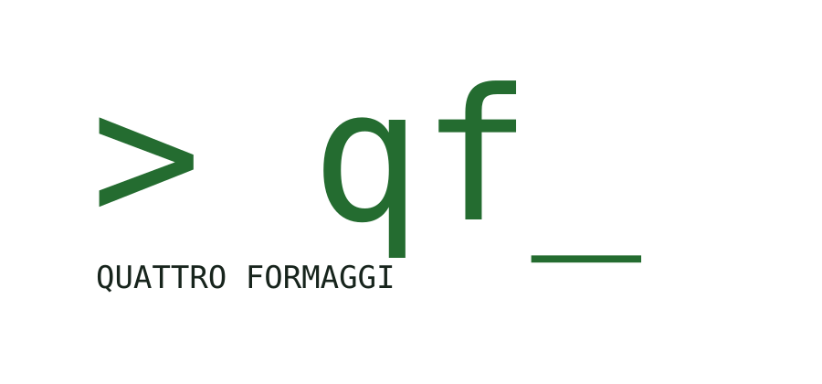

<p align="center">
  <picture>
    <source media="(prefers-color-scheme: dark)" srcset="docs/brand/logos/qf-logo-transparent-dark.svg">
     qf_" width="360">
  </picture>
</p>

# Quattro Formaggi

**От заявки к проверяемой карточке.**

Воспроизводимый проект дообучения и оценки локальной языковой модели для логистики:

- **QF-12B** — QLoRA-адаптер к `mistralai/Mistral-Nemo-Instruct-2407` для одного сценария v0.1: текст заявки на перевозку → JSON-карточка груза (`card_v2`: маршрут, даты, груз, масса, места, тип транспорта, особые условия) + список недостающих полей и противоречий; экспорт в GGUF для LM Studio.
- **QF-Lab** — отдельный учебный трек: собственный Transformer ~100M параметров, обучение с нуля (ещё не начат).

## Статус (06.10.2026)

Реализованы шаги 1–19 плана (`IMPLEMENTATION_PLAN.md`): данные, оценка, обучение, экспорт в GGUF, команда `qf extract`, приёмка в LM Studio и сборка выпуска v0.1 (`qf release build|check`, модельные карточки в `docs/release/`). Проект прикладной: академические приёмы (пороги до обучения, замороженный benchmark, доверительные интервалы, журнал экспериментов) применены, чтобы обосновать инженерные решения, а не чтобы претендовать на научную новизну.

- **Данные** (шаги 2–8, подшаги V1–V6): закреплённый табличный датасет `yogape/logistics-operations` (MIT) → факты о 85 410 загрузках с российскими городами → синтетические заявки по детерминированным шаблонам; эталоны вычисляет код, не LLM. `generated_v2`: 1 500 train / 150 val / 600 test / 300 test_ood. Замороженный benchmark `bench_v2` — 271 запись, из них 33 заявки-макета, написанные ассистентом; настоящих заявок нет.
- **Оценка** (шаги 9–10): 26 метрик, критические ошибки, bootstrap-интервалы, McNemar; пороги релиза П1–П6 утверждены до обучения (`docs/EVAL_SPEC.md`, D-112).
- **Обучение** (шаги 11–13, D-118): QLoRA r=16 (0,46% параметров), одна эпоха, три seed на арендованной H100 NVL, 24–29 минут и 149–179 ₽ на seed (три прогона).
- **Экспорт** (шаги 14–17): оценка адаптера в HF, резервная копия, слияние в bf16 (воспроизводится побайтно), GGUF закреплённым llama.cpp `42916d83` (его содержал runtime LM Studio 2.44.0; при приёмке был активен runtime 2.47.0 на коммите `6c7a87f`, см. D-132).

**Результаты на `bench_v2`** (271 заявка, жадная генерация, без JSON-схемы):

| модель | backend | key_field_accuracy | json_valid_rate | критических ошибок |
|---|---|---|---|---|
| правила на регулярных выражениях (нижняя граница) | — | 0,874 | 1,0 | — |
| исходная база, GGUF Q4_K_M (E100) | LM Studio | 0,005 | 0,026 | — |
| исходная база, 4 бит | HF | 0,014 | 0,063 | 14 |
| адаптер seed 42 + база 4 бит (E303) | HF | 0,951 | 0,993 | 3 |
| слитая модель bf16 (E304) | HF | 0,960 | 0,982 | 6 |
| слитая модель, GGUF BF16 (E305) | llama.cpp | 0,951 | 0,978 | 7 |
| слитая модель, GGUF Q6_K (E305) | llama.cpp | 0,960 | 0,985 | 6 |
| слитая модель, GGUF Q4_K_M (E305) | llama.cpp | 0,960 | 0,985 | 11 |
| исходная база, GGUF Q4_K_M нашей сборки (E306) | LM Studio | 0,0045 | 0,037 | — |
| **слитая модель, GGUF Q6_K — релизный вариант (E306)** | LM Studio | **0,9505** | **0,989** | **7** |

**Пороги релиза** (Q6_K в LM Studio, контекст 4096; подробности и значения в других системах — `docs/EVAL_SPEC.md`):

| Порог | Значение | Итог |
|---|---|---|
| П1 json ≥ 0,98 | 0,9889 | выполнен |
| П2 key ≥ 0,95 | 0,9505 | выполнен |
| П3 ноль выдуманных и пропущенных значений в трудном срезе | 1 пропущенное условие | не выполнен (D-128) |
| П3м не больше 2 таких ошибок на 33 макетах | 4 | не выполнен (D-128) |
| П4 прирост к базе ≥ 5 п. п. | +0,946 | выполнен |
| П5 потеря квантования ≤ 2 п. п., без новых критических ошибок трёх видов П3 | +0,009, новых 0 | выполнен (llama.cpp) |
| П6 лучше правил: ≥ 0,874, макеты > 0,704 | 0,9505; 0,741 | выполнен |

Скорость на Apple M4 Max: около 25 токенов/с, время до первого токена 0,5 с, память процесса около 10 ГиБ; стабильность — 28 из 30 запросов разобраны строго.

**Ограничения:** только синтетические заявки, качество на настоящих письмах не измерено (на макетах key 0,67–0,82 в зависимости от seed и формата); 20 российских городов; незнакомые шаблоны заявок (test_ood T7 — 0,86) и жаргон. Перечень доработок — `docs/TODO.md`.

Все решения — `docs/DECISIONS.md` (D-012…D-134); журнал исследования и карточки экспериментов ведутся вне Git.

Документы: `Quattro_Formaggi_DEVELOPMENT_PLAN.md` (план разработки), `IMPLEMENTATION_PLAN.md` (пошаговый план), `docs/PROJECT.md` (паспорт проекта), `docs/ARCHITECTURE.md`, `docs/DECISIONS.md`, `docs/EVAL_SPEC.md`, `docs/DATA_SPEC.md`, `docs/MODEL_CARD.md`, `docs/brand/` (дизайн-система: логотипы, цвета, шрифты, баннеры), `docs/TODO.md`, `docs/PLAN_card_v2.md` (план карточки `card_v2`), `AGENTS.md` (правила для coding agents).

## Быстрый старт

Нужны `uv` и `git`. Python 3.11 uv установит сам. Закреплённый llama.cpp (шаг 17) — git-подмодуль: `git clone --recurse-submodules …` или `git submodule update --init` в уже склонированном репозитории.

```bash
uv sync --extra dev        # окружение разработки (без torch/CUDA)
uv run qf --version
uv run qf doctor           # read-only отчёт об окружении → runs/doctor/hardware.json
uv run qf data fetch       # скачать закреплённую ревизию датасета (~31 MB) → data/raw/
uv run qf data fetch --verify-only   # проверить скачанные файлы по provenance.json
uv run qf data profile     # 10 проверок целостности → data/processed/profile_report.{json,md}
uv run qf data facts       # факты о 85 410 загрузках с российскими городами → data/processed/load_facts.jsonl
uv run qf data build       # факты + 2 050 учебных записей → data/processed/generated_v1/*.jsonl
uv run qf validate-data    # утечки, дубликаты, схема → generated_v1/validation_report.json (код 1 при ошибках)
uv run qf data report      # состав и длины → generated_v1/length_report.{json,md}
uv run qf bench verify     # замороженный bench_v1 совпадает со своим sha256
uv run qf bench verify --config configs/eval/benchmark_v2.yaml   # замороженный bench_v2 (card_v2) совпадает со своим sha256
```

Проверка eval-harness без модели (fake-backend отвечает эталоном с внесёнными ошибками; это **не** результат модели):

```bash
uv run python -m tests.fake_eval   # ответы и конфиги → data/processed/fake_eval/
uv run qf eval run --config data/processed/fake_eval/fake_bench_v1.yaml       # → runs/<run_id>/report.md
uv run qf eval run --config data/processed/fake_eval/fake_bench_v1_gold.yaml
uv run qf eval compare runs/<run_id A> runs/<run_id B>                        # → runs/<run_id>/compare.md
uv run python -m tests.fake_eval --bench data/splits_v2/bench_v2.jsonl        # то же для bench_v2 (card_v2)
uv run qf eval run --config data/processed/fake_eval/fake_bench_v2.yaml
```

Ручная проверка в браузере (без модели; сервер только на этом компьютере): `uv run qf ui`, затем открыть http://127.0.0.1:8765/.

Работа с моделью в LM Studio (шаг 18; нужен импорт GGUF и запущенный сервер — только по решению человека):

```bash
lms import --copy --user-repo qf-local/Quattro-Formaggi-12B-Logistics-v0.1-GGUF artifacts/gguf/Quattro-Formaggi-12B-Logistics-v0.1-Q6_K.gguf
lms load quattro-formaggi-12b-logistics-v0.1 --context-length 4096 --gpu max --parallel 1
lms server start --port 1234 --bind 127.0.0.1
uv run qf extract --text "Нужна реф-фура Пермь - Казань, 18 паллет, 12,6 т, +2..+6, погрузка 14 октября" --request-date 2026-09-30
uv run qf eval-baseline --config configs/eval/lmstudio_merged_q6k_bench_v2.yaml --json-schema off   # проверка порогов (E306)
```

Выпуск (шаг 19; ничего не загружается наружу):

```bash
uv run qf release build     # манифест выпуска + карточки → artifacts/release/
uv run qf release check     # артефакты, родословная до сырого датасета, карточки (хэши всех файлов, несколько минут)
```

Поддерживаемое оборудование: разработка, данные и inference — macOS на Apple Silicon (LM Studio); обучение QLoRA, оценка в HF, слияние и сборка GGUF — арендованная машина Linux + NVIDIA (использовалась 1× H100 NVL 94 ГБ). См. `docs/PROJECT.md`, раздел 4.

## Команды

| Команда | Шаг | Статус |
|---|---|---|
| `qf doctor [--out PATH]` | 1 | реализована |
| `qf data fetch [--config PATH] [--verify-only]` | 2 | реализована |
| `qf data profile [--source-config PATH] [--expectations PATH]` | 3 | реализована |
| `qf data facts [--config PATH] [--source-config PATH]` | 5 | реализована |
| `qf data facts-v2 [--table PATH]` | V2 | реализована: транспорт и особые условия для `card_v2` → `data/processed/load_facts_v2.jsonl` и отчёт `facts_v2_report.md` |
| `qf data build [--config PATH] [--facts-config PATH] [--source-config PATH]` | 6, V3 | реализована; с `--config configs/data/generate_v2.yaml` строит факты v2 и `generated_v2` |
| `qf validate-data [--data-dir DIR] [--bench FILE]` | 7, V4 | реализована; для `card_v2` — `--data-dir data/processed/generated_v2` |
| `qf data split [--data-dir DIR]`, `qf data split --input FILE --out-dir DIR [--config PATH]` | 7 | реализована |
| `qf data report [--data-dir DIR]` (`--tokenizer` — шаг 11) | 7 | реализована |
| `qf bench export-review / import-review / freeze [--manual FILE] / verify` (`--config PATH`) | 8, V5 | реализованы; порядок — `docs/EVAL_SPEC.md`; для `card_v2` — `--config configs/eval/benchmark_v2.yaml` → `data/splits_v2/` |
| `qf eval run --config PATH [--resume RUN_DIR]`, `qf eval compare RUN_A RUN_B` | 9, V6 | реализованы для `card_v1` и `card_v2`; backends `fake`, `openai_local` (LM Studio / `llama-server`), `hf_local` (шаг 14); метрики — `docs/EVAL_SPEC.md` |
| `qf ui [--port 8765]` | — | реализована: локальный веб-интерфейс для ручной проверки — заявки и эталоны, оценка ответа, генератор, отчёты прогонов (D-107) |
| `qf eval-baseline --config PATH --json-schema on\|off [--resume RUN_DIR]` | 10 | реализована: baseline модели в LM Studio в одном из двух режимов (backend `openai_local`); нижняя граница — `qf eval run` с `configs/eval/baseline_{empty,rules}_v2.yaml` |
| `qf tokens fetch [--config PATH]`, `qf tokens audit [--data DIR] [--max-len 2048]` | 11 | реализованы: файлы токенизатора закреплённой ревизии без весов; аудит маски обучения → `runs/<id>/mask_audit.md` (D-113) |
| `qf train estimate [--tps N] [--rate R]`, `qf train run [--config PATH] [--max-steps N] [--save-every N] [--eval-every N]`, `qf train run --resume runs/<id>/checkpoint-N`, `qf train fetch-base` | 12 | реализованы: оценка шагов, токенов, памяти и стоимости → `runs/<id>/estimate.md`; обучение QLoRA с контрольными точками и продолжением; веса базы (~24,5 ГБ) — только на GPU-машине после одобрения (D-114…D-117). Репетиция на CPU: `qf train run --config configs/train/tiny_cpu_test.yaml`. Протокол (D-118): платный прогон — `qf train run --experiment E302 [--seed N] --approval "…"` (зарегистрированный эксперимент, чистое git-дерево); `qf train verify runs/<id>` — проверка скопированного прогона |
| `qf eval run --config configs/eval/hf_*_v2.yaml` | 14 | реализована: оценка генерацией в HF на GPU-машине — база в 4 бит с адаптером или без, пакетами; целые `test`/`test_ood` (`bench.kind: sft_dataset`) (D-120) |
| `qf export adapter runs/<id> --name NAME`, `qf export verify --adapter PATH` | 15 | реализованы: резервная копия принятого адаптера в `artifacts/adapters/<name>/` со своим манифестом и её проверка; копию вне компьютера делает автор проекта (D-121) |
| `qf export merge --adapter artifacts/adapters/<name> [--out DIR]`, `qf export verify --merged DIR [--files-only]` | 16 | реализованы: адаптер вливается в базу bf16 → `artifacts/merged/…` (HF safetensors, токенизатор базы без изменений, манифест с хэшами); проверка слитой модели против «база + адаптер» или только по файлам (D-122). Нужна машина с GPU и ≥48 ГБ RAM |
| `qf export gguf --source DIR --name NAME [--qtypes Q4_K_M,Q5_K_M\|none]`, `qf export verify --gguf FILE` | 17 | реализованы: HF-модель → GGUF BF16 → квантованные GGUF закреплённым llama.cpp (`third_party/llama.cpp` @42916d83 — как в LM Studio 0.4.25), метаданные сверяются с HF; качество — `qf eval run` против `llama-server` (`configs/eval/llamacpp_*`) (D-123, D-124) |
| `qf extract (--text TEXT \| --file FILE) [--request-date YYYY-MM-DD] [--language auto\|ru\|en] [--config configs/runtime/extract.yaml] [--json]` | 18 | реализована: заявка → карточка `card_v2` через локальную модель (LM Studio, `openai_local`, только loopback); ответ разбирается строго, `missing_fields` пересчитывает код, значения проверяются независимо (город, даты, вес); статус `ok` / `invalid_output` / `backend_error`, код выхода 0 только при `ok` (D-126) |
| `qf release build [--config configs/release/release_v0.1.yaml]`, `qf release check [--release-dir DIR] [--skip-hashes]` | 19 | реализованы: сборка манифеста выпуска и копирование карточек; проверка артефактов, родословной до сырого датасета (с хэшами), карточек (нет `<…>`, хэши артефактов названы, таблица порогов с числами) — код 0 только если всё на месте (D-130) |
| `qf lab …` | L1–L6 | не реализована |

Нереализованная команда всегда завершается кодом 2 с сообщением `Stage <N> is not implemented yet` — она никогда не имитирует успешный результат.

## Материалы выпуска v0.1

- Веса и адаптер: https://huggingface.co/MikhailSAI/Quattro-Formaggi-12B-Logistics-v0.1
- GGUF (BF16 и Q6_K): https://huggingface.co/MikhailSAI/Quattro-Formaggi-12B-Logistics-v0.1-GGUF
- Синтетические данные и `bench_v2`: https://huggingface.co/datasets/MikhailSAI/Quattro-Formaggi-Logistics-Synthetic-v0.1
- Технический отчёт (arXiv): ссылка будет добавлена после публикации.

Системный промпт `system_extract_v2` (`src/qf/domain/prompts/system_extract_v2.txt`): SHA-256 `fa329729…` относится к тексту без завершающего перевода строки; файл с ним даёт `30f2f85e…`.

## Лицензия

Код проекта — Apache-2.0 (файл `LICENSE`). Лицензии весов и данных указаны в их карточках: модель — Apache-2.0 (как у базы Mistral-Nemo-Instruct-2407), датасет — MIT (как у источника `yogape/logistics-operations`).

## Проверки качества (после каждого шага)

```bash
uv run ruff format --check .
uv run ruff check .
uv run mypy src/qf
uv run lint-imports
uv run pytest -q -m "not slow and not gpu and not network and not lmstudio and not needs_tokenizer and not llama_server"
uv run pytest --cov=qf --cov-report=term-missing   # покрытие ≥85% для лёгких пакетов
```

Тесты с маркерами `network`, `gpu`, `lmstudio`, `llama_server` без явного флага пропускаются: `--run-network` (скачивает данные — только с разрешения), `--run-gpu`, `--run-lmstudio`, `--run-llama-server` (ворота шага 17 с запущенным `llama-server`).

## Данные и веса

Каталоги `data/`, `artifacts/` (`adapters/`, `merged/`, `gguf/`, `base_model/`), `runs/`, venv конвертера `.venv-convert/`, сборка `third_party/llama.cpp-build/` и файлы весов (`*.gguf`, `*.safetensors`, `*.bin`) не хранятся в Git. Ничего не загружается во внешние сервисы автоматически; веса модели и GGUF публикуются только решением человека (шаг 19); они опубликованы автором, адреса — в разделе «Материалы выпуска v0.1».
