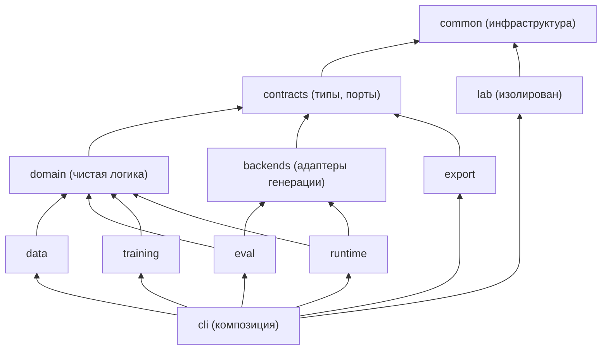

# ARCHITECTURE.md — архитектура Quattro Formaggi

Источник: `IMPLEMENTATION_PLAN.md`, Часть C (перенесена на шаге 1). Этот документ — обязательный контракт для всех шагов; его правила проверяются автоматически:

- `uv run lint-imports` — контракты импорта из C.3 (конфигурация `[tool.importlinter]` в `pyproject.toml`);
- `tests/architecture/` — изоляция QF-Lab, публичный API пакетов, импорт лёгких пакетов без `torch`/`transformers`/`peft`/`bitsandbytes`/`gguf`, наличие реализации у каждого порта, документирование каждого имени из реестров в таблице ниже;
- `tests/contracts/` — контрактные тесты портов и артефактов (C.8).

При изменении архитектуры обновлять и этот файл, и Часть C плана.

Цель архитектуры — чтобы любой компонент можно было **улучшить или заменить**, не ломая остальную систему. Примеры таких замен: другая базовая модель, другой runtime вместо LM Studio, реальные заявки вместо синтетики, `card_v2` с габаритами, другой training backend, добавление RAG.

Эта часть — обязательный контракт для всех шагов. Код, нарушающий правила C.3, не принимается, даже если тесты шага проходят.

## C.1. Шесть принципов

1. **Слои с односторонними зависимостями.** Нижние слои не знают о верхних. Направление зависимостей описано в C.3 и проверяется автоматически через `import-linter`.
2. **Порты и адаптеры.** Всё, что может быть заменено (модель-генератор, обучатель, конвертер, источник данных, семейство шаблонов, метрика), описано интерфейсом (`typing.Protocol`) в `qf.contracts.ports`. Конкретные реализации — адаптеры в своих пакетах. Код-потребитель зависит только от интерфейса.
3. **Реестры и выбор реализации через конфиг.** Реализации регистрируются по имени в реестре (`qf.common.registry`). В YAML-конфиге указывается `name`. Заменить компонент = добавить модуль, зарегистрировать его и поменять одну строку конфига. Код pipeline при этом не меняется.
4. **Стадии общаются только через артефакты на диске.** У каждой стадии есть вход и выход — файлы с манифестом: тип, версия схемы, sha256, run_id производителя, родительские артефакты. Стадия не импортирует код другой стадии. Любую стадию можно переписать, если она выпускает артефакт того же контракта.
5. **Версионированные контракты.** Схема карточки (`card_v1`), формат записи SFT, системный промпт, benchmark и формат манифеста имеют версии. Новая версия — новый модуль рядом со старым, а не правка старого. Потребитель явно объявляет поддерживаемые версии и падает с понятной ошибкой на неизвестной.
6. **Чистое ядро, тяжёлое на краях.** Доменная логика (схемы, единицы, правила, метрики) — чистый Python без `torch`/`transformers` и без ввода-вывода. Тяжёлые библиотеки импортируются только внутри адаптеров и только лениво (внутри функций или модулей адаптера). Пакет `qf` и все его «лёгкие» части импортируются на Mac без CUDA-стека.

## C.2. Структура кода

```text
src/qf/
├── common/              # ИНФРАСТРУКТУРА (без знаний о предметной области)
│   ├── errors.py        #   иерархия исключений
│   ├── paths.py         #   корень проекта и стандартные каталоги
│   ├── hashing.py       #   sha256 файлов/текста/JSON
│   ├── manifest.py      #   RunManifest, запись/обновление run_manifest.json
│   ├── artifacts.py     #   ArtifactRef, ArtifactManifest, чтение/запись/проверка артефактов
│   ├── registry.py      #   generic Registry[T]
│   ├── config.py        #   YAML → Pydantic, хэш конфига
│   ├── logging.py
│   └── seed.py
├── contracts/           # КОНТРАКТЫ (типы и интерфейсы; зависит только от common)
│   ├── _model.py        #   ContractModel (strict, frozen, extra=forbid), NonEmptyStr — шаг 4
│   ├── card_v1.py       #   ShipmentCard, Quantity, Place, Conflict, ExtractionTarget
│   ├── records.py       #   SFTRecord, VariantInfo (Message — из generation.py)
│   ├── generation.py    #   GenerationRequest, GenerationResult
│   ├── facts.py         #   LoadFacts (шаг 5)
│   ├── rendering.py     #   RenderedField, RenderedRequest, RequestDraft (шаг 6)
│   ├── evaluation.py    #   CaseScore (шаг 9)
│   ├── training.py      #   TokenStats, Estimate (шаг 12)
│   ├── models.py        #   ModelRef(id, revision) (шаг 12)
│   ├── ports.py         #   все Protocol-интерфейсы (C.4)
│   └── versions.py      #   SUPPORTED_SCHEMA_VERSIONS, проверки версий
├── domain/              # ДОМЕННАЯ ЛОГИКА (чистые функции; contracts + common)
│   ├── units.py         #   to_kg, from_kg, правила округления
│   ├── rules.py         #   compute_missing_fields, check_target_consistency, total_weight_kg
│   ├── geo.py           #   20 российских городов: регионы, EN-названия, падежи, координаты
│   ├── serialization.py #   serialize_target, parse_target, parse_target_lenient
│   ├── tasks.py         #   TaskSpec, реестр задач TASKS (D-040) — шаг 4
│   ├── record_checks.py #   check_record: проверки одной SFT-записи (коды шага 7) — шаг 4
│   ├── prompting.py     #   load_system_prompt, build_messages (единые для data/training/runtime)
│   ├── prompts/         #   system_extract_v1.txt (package data)
│   └── validation.py    #   независимая проверка значений карточки (даты, диапазоны, города) — шаг 18
├── backends/            # АДАПТЕРЫ ГЕНЕРАЦИИ (реализуют GenerationBackend)
│   ├── fake.py          #   для тестов
│   ├── openai_local.py  #   LocalOpenAIClient + backend: LM Studio, llama-server
│   └── hf_local.py      #   transformers (+ peft адаптер); тяжёлые импорты лениво
├── data/                # СТАДИИ ДАННЫХ: fetch, profile, facts, render/, generate, split, validate, report, benchmark
├── eval/                # ОЦЕНКА: metrics/, stats, harness, report
├── training/            # ОБУЧЕНИЕ QF-12B: features, collator, estimate, trainers/ (адаптеры AdapterTrainer)
├── export/              # ЭКСПОРТ: mergers/, converters/ (конвертация и квантование через llama.cpp), verify, gguf_meta, release
├── runtime/             # ПРИКЛАДНОЙ СЛОЙ: extract (сценарии, которые видит пользователь)
├── lab/                 # QF-LAB: полностью изолирован
└── cli/                 # КОМПОЗИЦИЯ: разбор аргументов, сборка объектов из конфига, вызов use-case
    ├── main.py          #   main(argv) -> int, таблица команд
    ├── wiring.py        #   build_backend(cfg), build_trainer(cfg), … — единственное место, где выбираются реализации
    └── commands/        #   по модулю на группу команд: data.py, eval.py, train.py, export.py, runtime.py, lab.py
```

Модули `qf.data.schema`, `qf.data.units`, `qf.data.rules`, `qf.data.geo`, `qf.data.prompts`, `qf.runtime.client`, `qf.eval.backends` из ранних версий плана **не создаются**. Их место — `qf.contracts`, `qf.domain` и `qf.backends` соответственно. Все шаги ниже уже используют новые пути.

## C.3. Правила зависимостей (проверяются `import-linter`)



Стрелка «A → B» означает «A может импортировать B» и транзитивно всё, что ниже B.

| Пакет | Может импортировать из `qf` | Запрещено |
|---|---|---|
| `common` | ничего | всё остальное |
| `contracts` | `common` | всё остальное |
| `domain` | `contracts`, `common` | `data`, `eval`, `training`, `export`, `runtime`, `backends`, `cli`, `lab` |
| `backends` | `contracts`, `common` | `domain`* , `data`, `eval`, `training`, `export`, `runtime`, `cli`, `lab` |
| `data` | `domain`, `contracts`, `common` | `eval`, `training`, `export`, `runtime`, `backends`, `cli`, `lab` |
| `eval` | `backends`, `domain`, `contracts`, `common` | `data`**, `training`, `export`, `runtime`, `cli`, `lab` |
| `training` | `domain`, `contracts`, `common` | `data`**, `eval`, `export`, `runtime`, `backends`, `cli`, `lab` |
| `export` | `contracts`, `common` | `data`, `eval`, `training`, `runtime`, `backends`, `cli`, `lab` |
| `runtime` | `backends`, `domain`, `contracts`, `common` | `data`, `eval`, `training`, `export`, `cli`, `lab` |
| `lab` | `common` | всё остальное |
| `cli` | всё | — |

\* Backend-у достаточно `messages` из `contracts`; сборка промпта — забота вызывающего.
\*\* `eval` и `training` получают данные **только как артефакты** (JSONL + манифест), читая их через `qf.common.artifacts` и `qf.contracts.records`, а не вызывая код `qf.data`.

Дополнительные правила:

- **Публичный API пакета.** Каждый пакет экспортирует публичные имена в своём `__init__.py` через `__all__`. Импорт из другого пакета — только из корня пакета (`from qf.domain import to_kg`), не из внутренних модулей (`from qf.domain.units import to_kg` — только внутри `qf.domain`). Исключение — `qf.cli.wiring`, которому можно импортировать модули адаптеров, чтобы зарегистрировать их.
- **Ленивые тяжёлые импорты.** `torch`, `transformers`, `peft`, `bitsandbytes`, `gguf`:
  - в `qf.common`, `qf.contracts`, `qf.domain`, `qf.data`, `qf.eval`, `qf.runtime` — запрещены совсем (исключения — `common/doctor.py` и `common/seed.py`: оба импортируют `torch` по имени во время выполнения через `qf.common._optional.import_optional`);
  - на уровне модуля — только в адаптерах: `backends/hf_local.py`, `training/trainers/**`, `export/mergers/**`, `export/converters/**`;
  - в остальных модулях `qf.training`, `qf.export`, `qf.backends` — только внутри функций. Это касается `training/tokenizer_io.py`, `training/audit.py`, `training/features.py`, `training/collator.py`, `export/verify.py`, `export/gguf_meta.py`;
  - модули-адаптеры не импортируются из `__init__.py` своих пакетов: их подключает только `cli.wiring` через `register_lazy`. Сам `cli/wiring.py` тоже не импортирует адаптеры на уровне модуля — только строки `"module:attr"`.
- **Никакого глобального состояния**, кроме реестров. Конфиг, пути и клиенты передаются аргументами.
- **CLI тонкий.** Функция команды: разобрать аргументы → загрузить конфиг → собрать объекты через `wiring` → вызвать одну функцию use-case → превратить результат/исключение в код выхода. Никакой бизнес-логики в `cli/`.

## C.4. Порты (интерфейсы) — `qf/contracts/ports.py`

Каждый порт — `typing.Protocol` с `@runtime_checkable`. Сигнатуры ниже — обязательные. Реализации могут иметь дополнительные методы, но потребители используют только эти.

**Правило типов:** каждый тип, который встречается в сигнатуре порта, объявлен в `qf.contracts` (файлы указаны в C.2). Ни один порт не ссылается на типы из `qf.data`, `qf.eval`, `qf.training`, `qf.export`. `random.Random`, `Path`, `Iterable` — стандартная библиотека.

**Порт добавляется в `ports.py` в том шаге, где появляется его первая реализация** (колонка «Шаг»), вместе с нужными типами. В шаге 1 `ports.py` создаётся пустым (только docstring с этим правилом). Так mypy и `lint-imports` остаются зелёными на каждом шаге.

| Порт | Методы | Реализации в v0.1 | Будущие замены (пример) |
|---|---|---|---|
| `RawSource` | `fetch(dest: Path) -> ArtifactRef`; `verify(ref) -> list[str]` | `hf_dataset` (шаг 2) | CSV из 1С/TMS, выгрузка реальных заявок |
| `FactsBuilder` | `build(raw: ArtifactRef) -> Iterable[LoadFacts]` | `logistics_operations_v1` (шаг 5) | другой табличный источник |
| `TemplateFamily` | `name: str`; `language: str`; `ood_only: bool`; `render(facts: LoadFacts, draft: RequestDraft, rng: Random) -> RenderedRequest` | T1–T8 (шаг 6) | новые стили, перефразирование локальной LLM |
| `HardCase` | `name: str`; `applicable(facts: LoadFacts) -> bool`; `apply(draft: RequestDraft, facts: LoadFacts, rng: Random) -> RequestDraft` (возвращает новый draft: какие поля убрать, какой конфликт вставить, какие отвлекающие числа добавить; семейство затем рендерит draft) | 7 видов (шаг 6) | новые трудные случаи |
| `Splitter` | `assign(records, cfg) -> list[SFTRecord]` | `group_hash` (шаг 7) | split по клиенту, по времени |
| `Metric` | `name: str`; `value(case: CaseScore) -> float\|bool\|None`; `aggregate(values) -> float` — метрика **не** разбирает ответ сама, а читает единый `CaseScore` из `score_prediction` (шаг 9), где строгий и мягкий разбор уже сделаны один раз | метрики шага 9 | метрики card_v2, LLM-as-judge (только локальный) |
| `GenerationBackend` | `name`; `model_id() -> str`; `generate(req: GenerationRequest) -> GenerationResult` | `fake`, `openai_local`, `hf_local` (шаги 9, 10, 14) | Ollama, vLLM, MLX |
| `AdapterTrainer` | `estimate(cfg, token_stats: TokenStats) -> Estimate`; `train(cfg, train: ArtifactRef, val: ArtifactRef, run_dir, resume: Path\|None) -> ArtifactRef` (kind=`lora_adapter`) | `hf_trainer_qlora` (шаг 12) | TRL, MLX LoRA на Mac, Unsloth |
| `Merger` | `merge(base: ModelRef, adapter: ArtifactRef, out: Path) -> ArtifactRef` (kind=`hf_model`) | `peft_merge` (шаг 16) | — |
| `ModelConverter` | `convert(model: ArtifactRef, out: Path, outtype: str) -> ArtifactRef` (kind=`gguf`) | `llama_cpp_convert` (шаг 17) | MLX-формат |
| `Quantizer` | `quantize(gguf: ArtifactRef, qtype: str, out: Path) -> ArtifactRef` | `llama_cpp_quantize` (шаг 17) | другие схемы квантования |

Порт `Retriever` для будущего RAG в v0.1 **не объявляется**: он появится вместе с первой реализацией в отдельном плане (C.9). `Splitter` и `RawSource` получают `cfg` как `Mapping[str, Any]` — параметры своей реализации (C.5).

## C.5. Реестры — `qf/common/registry.py`

```python
class Registry(Generic[T]):
    def __init__(self, kind: str) -> None: ...
    def register(self, name: str) -> Callable[[type[T] | Callable[..., T]], ...]: ...  # декоратор
    def get(self, name: str) -> Callable[..., T]:  # KeyError → QFError("unknown <kind> '<name>'; available: …")
    def names(self) -> list[str]: ...
```

- Повторная регистрация того же имени → `QFError` (защита от тихой подмены).
- Реестры объявляются рядом с портом-потребителем: `RAW_SOURCES`, `FACTS_BUILDERS`, `TEMPLATE_FAMILIES`, `HARD_CASES`, `SPLITTERS` в `qf.data`; `METRICS` в `qf.eval`; `BACKENDS` в `qf.backends`; `TRAINERS` в `qf.training`; `MERGERS`, `CONVERTERS`, `QUANTIZERS` в `qf.export`.
- `names()` возвращает и обычные, и ленивые записи. `get()` для ленивой записи импортирует модуль; если тяжёлой зависимости нет — `QFError("install extra 'train-cuda'")` с именем extra.
- Контрактные тесты (C.8) импортируют `qf.cli.wiring` (чтобы увидеть ленивые записи) и для каждой записи делают `pytest.importorskip` нужной тяжёлой библиотеки.
- Лёгкие реализации (шаблоны, метрики, fake-backend) регистрируются при импорте своего пакета. Тяжёлые (`hf_local`, `hf_trainer_qlora`, `peft_merge`) — регистрируются в `cli/wiring.py` через ленивую фабрику: `BACKENDS.register_lazy("hf_local", "qf.backends.hf_local:HFLocalBackend")`. Модуль импортируется только при вызове `get("hf_local")`.

Выбор реализации в конфиге — поле `name` + параметры реализации. **Закрытый discriminated union не используется**: он заставил бы править общий конфиг при каждой новой реализации.

- Общая модель конфига: `class ComponentConfig(BaseModel): name: str; model_config = ConfigDict(extra="allow")`.
- Каждая реализация объявляет вложенный класс `Config(BaseModel, extra="forbid")` со своими параметрами. Модель `Config` лежит в лёгком модуле рядом с адаптером (например, `training/trainers/hf_qlora/config.py` без тяжёлых импортов), а ленивая запись реестра хранит путь и к нему.
- `cli.wiring.build(registry, cc: ComponentConfig)` делает `impl = registry.get(cc.name)`; `params = impl.Config.model_validate(cc.model_extra)`; `return impl(params)`. Ошибки валидации указывают имя реализации и поле.

Пример:

```yaml
# configs/eval/lmstudio_bench_v1.yaml
backend:
  name: openai_local
  base_url: http://127.0.0.1:1234/v1
  model_substring: quattro
  use_json_schema: false
bench: {path: data/splits/bench_v1.jsonl, sha256: "<...>"}
metrics: [json_valid_rate, key_field_accuracy, field_accuracy, missing_f1, conflict_recall, hallucination_rate]
```

## C.6. Артефакты и контракты между стадиями — `qf/common/artifacts.py`

```python
class ArtifactRef(BaseModel):  # frozen, extra="forbid"
    kind: Literal[
        "raw_dataset",
        "load_facts",
        "sft_dataset",
        "benchmark",
        "predictions",
        "metrics",
        "lora_adapter",
        "hf_model",
        "gguf",
        "release",
    ]
    path: PurePosixPath  # ОТНОСИТЕЛЬНО project_root(); абсолютные пути запрещены валидатором
    sha256: str  # для каталога — хэш отсортированного списка (имя, sha256)
    schema_version: str  # например "sft_record_v1", "card_v1", "gguf_v3"
    producer_run_id: str
    parents: list[str] = []  # sha256 входных артефактов (родословная)
```

- Пути в манифестах всегда относительные (от `project_root()`, в POSIX-формате) и разрешаются при чтении: так артефакт, перенесённый `rsync` с Mac на GPU-машину (шаг 13), читается без правок.
- Рядом с каждым артефактом лежит `<artifact>.manifest.json` (сериализованный `ArtifactRef` + `extra` с деталями стадии).
- Функции: `write_artifact(obj_path, kind, schema_version, run_id, parents) -> ArtifactRef`, `read_artifact(path, expected_kind, supported_versions) -> ArtifactRef` (проверяет хэш, kind и версию, иначе `QFError`), `lineage(ref) -> list[ArtifactRef]`.
- **Цепочка стадий v0.1:**

| Стадия | Вход (kind@version) | Выход (kind@version) | Шаг |
|---|---|---|---|
| fetch | — | `raw_dataset@logistics_ops_csv_v1` | 2 |
| facts | `raw_dataset` | `load_facts@load_facts_v1` | 5 |
| generate | `load_facts` | `sft_dataset@sft_record_v1` (по сплитам) | 6–7 |
| bench | `sft_dataset` | `benchmark@sft_record_v1` | 8 |
| eval | `benchmark` + backend | `predictions@predictions_v1`, `metrics@metrics_v1` | 9–10, 14, 18 |
| train | `sft_dataset` (train, val) | `lora_adapter@peft_lora_v1` | 12–14 |
| merge | `lora_adapter` + base | `hf_model@hf_safetensors_v1` | 16 |
| convert/quantize | `hf_model` | `gguf@gguf_v3` | 17 |
| release | всё выше | `release@release_v1` | 19 |

Замена стадии допустима, если новая реализация читает те же входные kind/version и выпускает тот же выходной kind/version. Изменение формата артефакта = новая `schema_version` + чтение старой версии там, где это нужно, либо явный конвертер.

## C.7. Версионирование контрактов

- `card_v1` живёт в `qf/contracts/card_v1.py`. Будущая `card_v2` (например, с габаритами) — **новый файл** `card_v2.py`, а не правка `card_v1.py`. Плюс функция `upgrade_v1_to_v2()` в `qf/contracts/migrations.py`, если миграция возможна.
- `SFTRecord.schema_version`, промпт `system_extract_v<N>.txt`, `bench_v<N>.jsonl` — то же правило: новая версия рядом, старая не меняется.
- `qf.contracts.versions.SUPPORTED_SCHEMA_VERSIONS` — единственное место, где перечислены версии, которые умеет читать текущий код. Метрики, валидатор, runtime при неизвестной версии падают с `QFError`, а не пытаются угадать.
- Замороженный benchmark никогда не переписывается. Сравнения между моделями корректны только на одной версии benchmark + промпта + схемы, и `eval compare` это проверяет по манифестам (`test_compare_refuses_different_bench_versions`).

## C.8. Контрактные тесты (защищают замены)

Для каждого порта — **общий набор тестов, который автоматически прогоняется для всех зарегистрированных реализаций**. Новая реализация, зарегистрированная в реестре, тестируется без написания новых тестов.

| Файл | Что проверяет для каждой реализации |
|---|---|
| `tests/contracts/test_template_family_contract.py` | Параметризован по `TEMPLATE_FAMILIES.names()` × `HARD_CASES.names()`: инварианты E1–E15 шага 6 |
| `tests/contracts/test_backend_contract.py` | Для всех backend'ов, доступных без сети/GPU (`fake`, `openai_local` с `httpx.MockTransport`): возвращает `GenerationResult`; ошибка → `result.error`, а не исключение; не шлёт assistant-сообщение; `openai_local` отклоняет non-loopback URL |
| `tests/contracts/test_metric_contract.py` | Для всех `METRICS`: идеальный ответ → лучший балл; невалидный JSON → худший или `None`; `aggregate([])` не падает |
| `tests/contracts/test_trainer_contract.py` (`slow`) | Для тренеров, доступных на CPU: tiny-модель → артефакт `lora_adapter` с корректным манифестом; resume-эквивалентность |
| `tests/contracts/test_artifact_roundtrip.py` | Для всех `kind`: `write_artifact` → `read_artifact` → тот же `ArtifactRef`; подмена байта → ошибка хэша; чужой kind/версия → ошибка; абсолютный путь отклоняется; дерево, скопированное в другой корень (`tmp_path/a` → `tmp_path/b`), читается без ошибок |

Архитектурные тесты (`tests/architecture/`):

- `test_import_contracts` — запускает `lint-imports` (subprocess) и требует код 0;
- `test_lab_isolated` — AST-проверка из шага 1 (дублирует import-linter для наглядности);
- `test_light_packages_import_without_heavy_deps` — в отдельном процессе с `sys.modules["torch"] = None` (и так же для `transformers`, `peft`, `bitsandbytes`) импортируются `qf`, `qf.common`, `qf.contracts`, `qf.domain`, `qf.data`, `qf.eval`, `qf.runtime`, `qf.backends`, `qf.training`, `qf.export`, `qf.cli`;
- `test_cross_package_imports_use_public_api` — AST: в пакете X нет импортов вида `qf.Y.<внутренний_модуль>` для Y ≠ X (кроме `qf.cli.wiring`);
- `test_every_port_has_at_least_one_impl` — для каждого Protocol, **уже объявленного** в `ports.py`, в реестрах есть хотя бы одна реализация (включая ленивые записи). Порты добавляются вместе с реализацией, поэтому тест зелёный на каждом шаге;
- `test_registry_names_unique_and_documented` — каждое имя из реестров упомянуто в `docs/ARCHITECTURE.md` (таблица реализаций), чтобы документация не отставала.

## C.9. Процедура замены или улучшения модуля

Любая замена компонента выполняется одним и тем же сценарием:

1. **ADR.** Запись в `docs/DECISIONS.md`: что меняем, почему, какие критерии успеха, как откатить.
2. **Новая реализация рядом со старой.** Новый модуль + регистрация под новым именем. Старая реализация не удаляется и не меняется.
3. **Контрактные тесты** проходят для новой реализации автоматически (C.8). Если реализация требует изменения порта — это изменение контракта: новая версия порта или совместимое расширение с значением по умолчанию, и все реализации обновляются в том же изменении.
4. **Переключение конфигом.** Новый YAML (или новое значение `name`). Код pipeline не трогаем.
5. **Сравнение.** `qf eval compare` старого и нового варианта на одном и том же замороженном benchmark (где применимо).
6. **Удаление старой реализации** — не раньше следующего релиза и отдельным изменением.

Примеры, которые эта архитектура должна выдерживать без переписывания pipeline:

| Замена | Что меняется | Что не меняется |
|---|---|---|
| Другая базовая модель (например, 8B) | `configs/train/base_model.yaml`, повторный аудит маски (шаг 11), ожидаемое число LoRA-параметров | генератор, метрики, eval, runtime, экспорт |
| Ollama или vLLM вместо LM Studio | новый адаптер `GenerationBackend` + конфиг | eval, runtime-логика, метрики |
| Реальные заявки клиентов вместо синтетики | новый `RawSource` + конвертер в `sft_dataset@sft_record_v1` | валидатор, split, обучение, eval |
| Карточка `card_v2` с габаритами | новый `card_v2.py`, новые правила в `domain`, новые шаблоны, новый bench_v2 | инфраструктура артефактов, backends, trainer, export |
| TRL или MLX вместо HF Trainer | новый `AdapterTrainer` | данные, маска (переиспользуется `features.py`), eval, export |
| Добавление RAG | новый порт `Retriever` в `qf.contracts` + пакет `qf/retrieval/` с реализацией, новая версия промпта с контекстом | card-контракт, backends, eval-harness (добавляется метрика цитирования) |
| Новая задача для модели (v0.2, Часть G) | новая запись в реестре задач `TASKS` (свой системный промпт и схема ответа), свой генератор/источник данных, свой bench, метрики задачи | обучение, маска loss, экспорт, backends, существующие задачи |
| Формирование транспортных документов (v0.3, Часть G) | новый пакет `qf/documents/`: порт `DocumentRenderer` (проверенные поля → документ по версионируемому шаблону), реестр типов документов, схемы `<документ>_v1`, валидатор значений; задачи извлечения полей — в `TASKS` | backends, обучение, eval-harness, `card_v1` |
| Многопользовательский сервер (v0.4, Часть G) | адаптер `GenerationBackend` для vLLM или llama.cpp server (OpenAI-совместимый API) + отдельный сервисный слой (API, очередь, аутентификация, журнал) | данные, обучение, метрики, runtime-сценарии |

## Таблица реализаций (порт → имя в реестре → модуль → шаг)

Каждое имя, зарегистрированное в любом реестре (`qf.common.all_registries()` после импорта `qf.cli.wiring`), обязано присутствовать в этой таблице в обратных кавычках — это проверяет `tests/architecture/test_ports_and_registries.py::test_registry_names_unique_and_documented`. Строки добавляются в том шаге, где появляется реализация.

| Порт | Реестр | Имя в реестре | Модуль | Шаг | Ленивая регистрация |
|---|---|---|---|---|---|
| `RawSource` | `RAW_SOURCES` (`qf.data`, kind `raw_source`) | `hf_dataset` | `qf.data.fetch:HFDatasetSource` | 2 | нет (лёгкая: `huggingface_hub` — core-зависимость) |
| `FactsBuilder` | `FACTS_BUILDERS` (`qf.data`, kind `facts_builder`) | `logistics_operations_v1` | `qf.data.facts:LogisticsOpsFactsBuilder` | 5 | нет (лёгкая: pandas) |
| `TemplateFamily` | `TEMPLATE_FAMILIES` (`qf.data`, kind `template_family`) | `T1` (RU, деловое письмо) | `qf.data.render.families_ru:BusinessLetterRu` | 6 | нет |
| `TemplateFamily` | `TEMPLATE_FAMILIES` (`qf.data`, kind `template_family`) | `T2` (RU, мессенджер) | `qf.data.render.families_ru:MessengerRu` | 6 | нет |
| `TemplateFamily` | `TEMPLATE_FAMILIES` (`qf.data`, kind `template_family`) | `T3` (RU, список «поле: значение») | `qf.data.render.families_ru:ListRu` | 6 | нет |
| `TemplateFamily` | `TEMPLATE_FAMILIES` (`qf.data`, kind `template_family`) | `T4` (EN, formal email) | `qf.data.render.families_en:FormalEmailEn` | 6 | нет |
| `TemplateFamily` | `TEMPLATE_FAMILIES` (`qf.data`, kind `template_family`) | `T5` (EN, chat) | `qf.data.render.families_en:ChatEn` | 6 | нет |
| `TemplateFamily` | `TEMPLATE_FAMILIES` (`qf.data`, kind `template_family`) | `T6` (EN, key: value) | `qf.data.render.families_en:KeyValueEn` | 6 | нет |
| `TemplateFamily` | `TEMPLATE_FAMILIES` (`qf.data`, kind `template_family`) | `T7` (RU, сленг; только test_ood/bench) | `qf.data.render.families_ru:SlangRu` | 6 | нет |
| `TemplateFamily` | `TEMPLATE_FAMILIES` (`qf.data`, kind `template_family`) | `T8` (EN, длинное письмо; только test_ood/bench) | `qf.data.render.families_en:LongEmailEn` | 6 | нет |
| `HardCase` | `HARD_CASES` (`qf.data`, kind `hard_case`) | `dropped_fields` | `qf.data.render.hard_cases:DroppedFields` | 6 | нет |
| `HardCase` | `HARD_CASES` (`qf.data`, kind `hard_case`) | `per_piece_weight` | `qf.data.render.hard_cases:PerPieceWeight` | 6 | нет |
| `HardCase` | `HARD_CASES` (`qf.data`, kind `hard_case`) | `conflict_weight` | `qf.data.render.hard_cases:ConflictWeight` | 6 | нет |
| `HardCase` | `HARD_CASES` (`qf.data`, kind `hard_case`) | `conflict_pieces` | `qf.data.render.hard_cases:ConflictPieces` | 6 | нет |
| `HardCase` | `HARD_CASES` (`qf.data`, kind `hard_case`) | `relative_date` | `qf.data.render.hard_cases:RelativeDate` | 6 | нет |
| `HardCase` | `HARD_CASES` (`qf.data`, kind `hard_case`) | `distractor_numbers` | `qf.data.render.hard_cases:DistractorNumbers` | 6 | нет |
| `HardCase` | `HARD_CASES` (`qf.data`, kind `hard_case`) | `city_lang_switch` | `qf.data.render.hard_cases:CityLangSwitch` | 6 | нет |
| `Splitter` | `SPLITTERS` (`qf.data`, kind `splitter`) | `group_hash` | `qf.data.split:GroupHashSplitter` | 7 | нет |
| — (реестр без порта: записи — `TaskSpec`) | `TASKS` (`qf.domain`, kind `task`) | `shipment_extraction` (промпт `system_extract_v1`, схема ответа `card_v1`) | `qf.domain.tasks:SHIPMENT_EXTRACTION` | 4 | нет |

## Реализация на шаге 1: отличия от текста Части C

- Тяжёлые библиотеки в `qf.common` импортируются по имени во время выполнения только в двух местах — `common/doctor.py` и `common/seed.py` — через `qf.common._optional.import_optional`. Статический анализ `import-linter` таких импортов не видит, поэтому их набор ограничен и помечен комментариями в коде.
- Команда оценки называется `qf eval run` (а не `qf eval`): имя команды не может одновременно быть группой (`qf eval compare`) — иначе argparse принимает позиционный аргумент за подкоманду.
- `cli.wiring.build()` получает класс `Config` реализации, импортируя саму реализацию; путь к отдельному лёгкому модулю `Config` в ленивой записи реестра (C.5) пока не реализован — добавить на шаге 12, если конфиг обучения нужно валидировать без torch (D-021).
- Порт `RawSource` (шаг 2) шире строки таблицы C.4: `target(dest_root) -> Path` (где лежит или будет лежать артефакт — нужен для идемпотентного `qf data fetch` и `--verify-only`) и `fetch(dest_root, run_id)` (run создаёт вызывающий сценарий `fetch_raw_dataset`, а не адаптер: общая логика «уже скачано → проверить» и запись `run_manifest.json` не дублируются в каждой реализации). См. D-023.
- Форматы на диске версионируются полями `manifest_version` (`run_manifest_v1`), `artifact_manifest_version` (`artifact_manifest_v1`), `report_version` (`doctor_v1`) (D-019).
- `Registry(kind, port=..., discoverable=True)`: реестр хранит свой порт (для проверки «у каждого порта есть реализация») и регистрируется в глобальном списке `all_registries()`; частные реестры в тестах создаются с `discoverable=False`.

## Реализация на шаге 4: отличия от текста Части C

- Модели контрактов `card_v1` и `sft_record_v1` наследуют `ContractModel` (`qf/contracts/_model.py`): кроме `extra="forbid", frozen=True` они строгие (`strict=True`, `allow_inf_nan=False`) — без приведения типов (D-041). JSON читается только через `Model.model_validate_json(text)`.
- `Message` не дублируется в `records.py`: SFT-запись использует `Message` из `qf/contracts/generation.py` (шаг 1), чтобы сообщение для backend'а и сообщение записи были одним типом.
- Версия `card_v1` экспортируется из `qf.contracts` как `CARD_SCHEMA_VERSION` (в модуле `card_v1.py` — `SCHEMA_VERSION`), чтобы будущая `card_v2` не конфликтовала по имени. В `SUPPORTED_SCHEMA_VERSIONS` добавлены `sft_dataset: {sft_record_v1}` и ключ `target: {card_v1}` — это не kind артефакта, а схемы ответа внутри записей (`SFTRecord.schema_version`, `TaskSpec.target_schema_version`).
- Реестр задач `TASKS` не связан с портом (`port=None`): его записи — данные (`TaskSpec`), а не реализации. Он виден `all_registries()`, потому что `cli/wiring.py` импортирует `qf.domain`.
- Проверки одной SFT-записи (`check_record`) вынесены в `qf/domain/record_checks.py` и возвращают `Issue` с кодами шага 7 (`UNKNOWN_TASK`, `EMPTY_ASSISTANT`, `TARGET_PARSE`, `NOT_CANONICAL`, `TARGET_INCONSISTENT`); `qf validate-data` (шаг 7) вызывает её и добавляет межзаписные проверки.
- Города карточки — российские (D-047, D-048): `Place{city, region}`, справочник `qf.domain.CITIES`. Замена американских городов источника — данные конкретного датасета, поэтому она лежит не в `qf.domain`, а в `configs/data/city_map_ru_v1.yaml` и `qf.data.CityMap` (применяется при сборке фактов, шаг 5). Для другого источника данных (например, реальных российских заявок) таблица замены не нужна.
- `qf.common.format_validation_error` стал публичным (раньше — приватная функция `config.py`): им же форматируются ошибки разбора ответа модели.

## Реализация на шаге 5: отличия от текста Части C

- Порт `FactsBuilder` шире строки таблицы C.4: `build(raw, root)` и `inputs(root) -> dict[str, str]` — файлы, которые сборщик читает помимо сырого артефакта, с sha256 для манифеста запуска (D-052). `LoadFacts` — строгая модель `ContractModel`, а не dataclass (D-051). Стадия фактов запускается отдельной командой `qf data facts` (D-053).
- Разворот событий Pickup/Delivery по загрузке (`pickup_delivery_by_load`) лежит в `qf/data/raw_tables.py` и общий для `profile` и `facts` (D-054).

## Реализация на шаге 6: отличия от текста Части C

- Порты `TemplateFamily` и `HardCase` объявляют `name`, `language`, `ood_only` как свойства только для чтения (`@property`), а не изменяемые атрибуты: иначе mypy не считает класс с `language = "ru"` реализацией порта (D-058).
- Реестры `TEMPLATE_FAMILIES` и `HARD_CASES` лежат в `qf/data/registries.py`; пакет `qf.data.render` регистрирует T1–T8 и 7 трудных случаев при импорте (его импортирует `qf.data`).
- Семейства — наследники `LayoutFamily` (`render/base.py`): только слоты-предложения и их порядки; раскладку с проверкой «каждое поле размещено ровно один раз» и сборку эталона из evidence выполняет общий код. Новое семейство = класс со слотами + регистрация + строка в конфиге; контрактный тест проверит его автоматически.
- `qf data build` = стадия фактов (шаг 5) + стадия генерации; две записи `run_manifest.json`.

## Реализация на шаге 7: отличия от текста Части C

- Порт `Splitter`: `assign(records)` без `cfg` — параметры у реализации (`Config`), как у остальных адаптеров (D-062).
- Файлы записей читает и пишет один модуль `qf/data/sft_io.py` (D-064); валидатор находит маршрут записи через родительский артефакт `load_facts` (`qf.common.lineage` + `read_artifact`), а не через код генератора.
